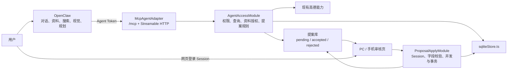

# 旅行足迹 AI 助手实施计划

> 状态：架构方案已调整
>
> 日期：2026-08-03
>
> 核心决策：OpenClaw 负责外部 Agent 编排，旅行足迹只提供受控 MCP 工具，并在项目内完成提案审核与最终写入。

## 是什么

### 1. 产品与架构定义

旅行足迹不再内置模型客户端、Agent 循环、网页搜索和视觉模型。AI 能力由用户已有的 OpenClaw 实例提供。

职责划分：

| 模块 | 负责内容 | 不负责内容 |
| --- | --- | --- |
| OpenClaw | 对话、理解目标、资料整理、自主检索、视觉识别、规划、重试、模型选择 | 直接访问数据库、替用户确认写入 |
| 旅行足迹 MCP | 提供授权地点、攻略、偏好、资料、高德能力；接收结构化提案 | 模型调用、网页检索、开放任意业务接口 |
| 项目审核页 | 展示来源、原值和建议值；逐字段接受或拒绝 | 自主检索和模型推理 |
| 确定性写入模块 | 权限校验、字段校验、并发检查、事务写入和审计 | 接受未经确认的 Agent 指令 |

核心流程：

1. 用户在 OpenClaw 中提出极简需求或发送现成资料。
2. OpenClaw 自主整理、检索、核验并调用旅行足迹 MCP 工具。
3. MCP 工具只能读取授权数据、调用确定性地图能力或创建待审核提案。
4. 用户回到旅行足迹审核页逐字段确认。
5. 项目使用普通网页登录 Session 执行最终写入。

OpenClaw 无论使用什么模型，都不能越过提案状态直接修改地点、攻略、行程或用户偏好。

### 2. 三种同级使用模式

三种模式都由 OpenClaw 接收，最终进入同一套项目提案审核流程。

| 模式 | 用户输入 | OpenClaw 行为 | 项目行为 |
| --- | --- | --- | --- |
| 整理我的资料 | 文本、Markdown、TXT、JSON、CSV、PDF、Word、Excel、截图或照片 | 提取、归一化、去重、识别冲突；用户要求不联网时禁止检索 | 提供授权上下文并接收提案 |
| 替我研究 | 一个极简目标、地点名称或约束 | 自主拆解问题、网页检索、调用高德工具、交叉核验 | 提供地点上下文、高德结果并接收提案 |
| 资料 + 补充检索 | 已有资料加“补齐、核实、更新”等要求 | 先尊重用户资料，只检索缺失、冲突和时效性字段 | 保存来源关系、冲突和提案 |

示例：

- “整理这些截图里的地点，不要联网。”
- “把这份攻略整理成地点资料，再核实最新门票。”
- “把我收藏但资料不全的地点补齐。”
- “找广州周边一小时车程、适合老人、有停车的三个地方。”
- “第二个太远，继续找，不要直接加入行程。”

### 3. 两条资料入口都要保留

#### OpenClaw 直接接收资料

这是首期最简单的主入口：

1. 用户通过 OpenClaw 对话发送文件、截图、照片或粘贴文字。
2. OpenClaw 使用自身的文档、视觉和检索能力处理资料。
3. OpenClaw 调用 MCP 查询项目现有地点，避免重复。
4. OpenClaw 提交一个或多个待审核提案。

该路径不要求旅行足迹实现文档解析器、OCR 或视觉模型适配器。

#### 旅行足迹先接收资料

该入口用于用户已经在项目页面操作的场景：

1. 用户通过普通 Session 上传资料。
2. 项目创建临时 materialId，并由用户明确勾选“允许 OpenClaw 读取”。
3. OpenClaw 通过 materials_list 和 material_read 读取本次授权的资料。
4. 授权在提案提交、到期或用户撤销后失效。

首期不要求项目主动调用 OpenClaw Gateway。用户可以在 OpenClaw 中说“整理我刚上传的资料”或提供 materialId。后续只有在确实需要项目内一键启动 Agent 时，才增加项目到 OpenClaw 的反向调用。

### 4. 自主性的归属与边界

OpenClaw 可以自主：

- 解释目标和硬约束；
- 制定检索计划；
- 搜索公开网页；
- 调用旅行足迹 MCP 只读工具；
- 检查资料缺口、冲突和时效；
- 根据结果继续检索；
- 请求一次必要澄清；
- 生成包含来源和置信度的提案；
- 根据用户反馈重新研究。

OpenClaw 不可以：

- 直接新增、更新或删除业务数据；
- 读取 Token 所属用户无权访问的地点、媒体和资料；
- 自行扩大 Token scope；
- 读取未明确授权的原始私有照片；
- 使用 OpenClaw Gateway 管理凭据访问旅行足迹；
- 把网页、附件或图片中的指令当作项目授权；
- 代替用户执行提案确认。

### 5. 首期提案字段

地点提案优先覆盖：

- 名称、别名、分类、地址、城市和坐标；
- 停车、门票、开放时间、最佳游玩时间和建议逗留；
- 路线距离、预计驾车时间和路线提示；
- 地点亮点、装备、注意事项和安全提示；
- 来源、发布时间、检索时间、置信度、冲突和待确认项。

首期允许新建地点提案和更新地点提案，不允许生成删除地点的提案、自动加入行程或自动改变访问权限。

## 为什么

### 1. 这会显著降低项目内 AI 复杂度

原计划要求旅行足迹自己维护：

- DeepSeek 文本模型调用；
- 千问和 Kimi 搜索、视觉适配；
- Tool Call 循环；
- 网页读取与 SSRF 防护；
- Agent 任务状态、队列、暂停、恢复和预算；
- 模型版本、Token 用量和供应商故障；
- 文档解析、OCR 和长上下文切片。

调整后这些能力由 OpenClaw 负责。旅行足迹只保留无法外包的领域责任：

- 用户与资源权限；
- MCP 工具白名单；
- Agent Token 管理；
- 临时资料授权；
- 提案结构和来源保存；
- 逐字段确认；
- 并发校验和确定性写入；
- 审计、限流和撤销。

复杂度不是消失，而是从业务项目移动到已经存在的 Agent 运行环境。项目不再重复实现 OpenClaw 已经提供的编排能力。

### 2. MCP 比直接开放现有 REST 更合适

当前所有普通 /api 接口依赖浏览器 Session；地点写入接口也是正式业务写入路径。不能把 Agent Token 伪装成 Session，也不能让 Agent 直接调用现有 POST、PATCH 和 DELETE。

单独提供 MCP 的优势：

- OpenClaw 可以自动发现工具名称、说明和参数结构；
- 使用 Streamable HTTP 作为远程传输，不需要为每个 REST 接口编写 Agent Skill 调用细节；
- 可以只投射允许的工具，不暴露项目完整接口；
- 工具输入可以直接使用 Zod 和 JSON Schema 严格校验；
- 后续更换 Agent 客户端时，项目领域接口不需要重写；
- OpenClaw 支持远程 MCP、OAuth 和 include/exclude 工具过滤。

MCP 只是外部 Adapter，真正的权限、读取和提案规则位于 AgentAccessModule。测试直接跨越 AgentAccessModule 的 interface 验证行为，不为尚不存在的第二种传输提前创建抽象 port。

### 3. 不能把安全责任交给 OpenClaw

即使 OpenClaw 是用户自建的，也必须按外部不可信客户端处理：

- Agent 可能被网页提示注入；
- OpenClaw 插件、Skill 或模型可能出现错误；
- 长期 Token 可能被日志、配置或备份泄露；
- 多个家庭用户可能共享同一个 OpenClaw 实例；
- 模型生成的数据可能不符合项目业务约束。

因此权限必须由旅行足迹根据 Token 对应的 userId 和 scope 重新判断。请求中的 userId、ownerId、role 或 visibility 都不能作为授权依据。

### 4. Token 是认证凭据，不是业务授权本身

“Token 加密访问”应拆成三件事：

1. HTTPS/TLS 负责传输加密。
2. 随机 Token 或 OAuth Access Token 负责证明 Agent 身份。
3. 服务端 scope、资源归属和业务规则决定具体能做什么。

首期单用户或少量家庭成员使用随机不透明 PAT 最简单。公网、多客户端或需要浏览器授权时再升级 OAuth 2.1。

### 5. 不再需要 PydanticAI

PydanticAI 原本用于项目内实现 Agent 编排。采用 OpenClaw 后，项目不再拥有模型循环、搜索计划和多模型适配，因此没有引入 Python Sidecar 的理由。

项目只需要 TypeScript MCP SDK、Zod 和现有 Express/SQLite 能力。模型选择和 Agent 框架完全属于 OpenClaw 配置。

### 6. 模型选择与项目解耦

OpenClaw 内可继续按用户偏好配置：

- DeepSeek 作为主要推理和整理模型；
- 千问或 Kimi 处理视觉和检索；
- 高德地点、坐标和路线继续由旅行足迹 MCP 提供。

旅行足迹仓库不保存这些模型的 SDK、密钥、Prompt 或供应商专用代码。更换模型不需要发布旅行足迹新版本。

### 7. 必须接受的代价

外部编排降低了项目代码复杂度，但带来明确取舍：

- 用户主要在 OpenClaw 中发起 AI 任务，项目首期只有提案审核，不展示完整研究进度。
- 项目无法仅靠自身代码保证 OpenClaw 没有联网；严格“不联网”必须由 OpenClaw 的独立 Agent 配置和工具白名单强制。
- OpenClaw 停止运行时不能继续 AI 研究，但不影响旅行足迹手工功能。
- OpenClaw 版本、Skill 和 MCP 兼容性成为部署验收的一部分。
- 如果未来要求在项目内一键发起、实时显示过程和继续对话，就需要增加项目到 OpenClaw Gateway 的受控反向调用。

这些代价比在项目内长期维护完整 Agent 栈更可控，但必须在产品说明和验收中明确。

## 怎么办

### 1. 总体架构



信任关系：

- OpenClaw 是外部客户端。
- McpAgentAdapter 只负责协议、认证入口和结构转换。
- AgentAccessModule 是 Agent 访问项目能力的唯一 interface。
- ProposalApplyModule 是提案进入正式业务数据的唯一 interface。
- sqliteStore.ts 继续是持久化入口。

### 2. 深模块接口

AgentAccessModule 对外保持小接口：

```ts
interface AgentAccessModule {
  query(input: AgentQuery, actor: AgentActor): Promise<AgentQueryResult>;
  readMaterial(input: MaterialRead, actor: AgentActor): Promise<MaterialResult>;
  submitProposal(input: ProposalDraft, actor: AgentActor): Promise<ProposalReceipt>;
}
```

内部隐藏：

- Token scope 与用户映射；
- canRead 和 canModify 规则复用；
- 地点、攻略和偏好的序列化；
- 高德调用；
- 资料授权和到期；
- Zod 校验；
- 来源去重；
- 提案幂等；
- 审计与限流。

ProposalApplyModule 仅供网页登录 Session 调用：

```ts
interface ProposalApplyModule {
  preview(proposalId: string, actor: SessionActor): Promise<ProposalPreview>;
  apply(
    proposalId: string,
    selection: FieldSelection,
    actor: SessionActor,
  ): Promise<ApplyResult>;
  reject(proposalId: string, actor: SessionActor): Promise<void>;
}
```

MCP Adapter 永远不能获得 ProposalApplyModule。

### 3. MCP 工具

#### 只读工具

| 工具 | 用途 | 必要 scope |
| --- | --- | --- |
| places_search | 按名称、分类、状态和关键词查地点摘要 | places:read |
| place_get | 读取单个有权限地点及现有字段 | places:read |
| guides_get | 读取指定地点关联攻略 | guides:read |
| preferences_get | 读取用户明确确认的旅行偏好 | preferences:read |
| materials_list | 只列出本次明确授权且未过期的资料 | materials:read |
| material_read | 读取指定授权资料或分块内容 | materials:read |
| media_metadata_get | 读取选中媒体的非敏感元数据 | media:metadata |
| amap_poi_search | 查询 POI、地址、坐标候选 | amap:read |
| amap_reverse_geocode | 核对坐标对应地址 | amap:read |
| amap_driving_route | 计算路线距离和预计耗时 | amap:read |
| proposal_get | 读取 Agent 自己提交的提案状态 | proposals:read |

#### 提案工具

| 工具 | 用途 | 必要 scope |
| --- | --- | --- |
| place_proposal_submit | 创建地点新增或更新提案 | proposals:create |

首期不提供：

- place_create；
- place_update；
- place_delete；
- guide_write；
- trip_add_item；
- media_file_get；
- proposal_confirm；
- 任意 SQL 或通用 HTTP 请求工具。

OpenClaw 自己负责网页检索，旅行足迹 MCP 不提供通用网页搜索或任意 URL 读取工具。

### 4. 提案契约

```ts
type PlaceProposalDraft = {
  clientRequestId: string;
  operation: 'create' | 'update';
  targetPlaceId?: string;
  baseUpdatedAt?: string;
  values: Record<string, unknown>;
  claims: Array<{
    field: string;
    value: unknown;
    sourceIds: string[];
    confidence: 'high' | 'medium' | 'low';
    freshness: 'fresh' | 'aging' | 'stale' | 'unknown';
    conflict?: {
      alternatives: unknown[];
      reason: string;
    };
  }>;
  sources: Array<{
    id: string;
    type: 'user_material' | 'amap' | 'official_web'
      | 'general_web' | 'ugc' | 'photo' | 'model_inference';
    title: string;
    url?: string;
    publishedAt?: string;
    retrievedAt: string;
    excerpt?: string;
  }>;
  warnings: string[];
  unanswered: string[];
};
```

服务端收到提案后：

1. 重新校验 operation、目标地点归属和字段白名单。
2. 过滤未知字段，不允许 Agent 提交 created_by、visibility、权限或系统时间。
3. 检查每个事实字段是否有来源或明确标记为模型建议。
4. 对 URL、摘要长度、数组数量和总请求大小设上限。
5. 使用 agentId + clientRequestId 保证幂等。
6. 只保存为 pending，不修改正式业务数据。
7. 返回 proposalId 和项目审核地址。

### 5. 来源和冲突规则

项目不重新执行 OpenClaw 的研究过程，但必须保存可审核证据：

- 用户个人体验、备注和计划优先于公开网页。
- 地址、坐标和路线优先使用 MCP 返回的高德结果。
- 门票、开放时间和临时政策优先使用管理方官方来源。
- 非官方重要时效信息需要多个独立来源，否则标记低置信。
- 模型推断不能成为坐标、门票、开放时间和安全限制的唯一依据。
- 搜索摘要不能伪装成已读取的原页面。
- 用户资料与公开资料冲突时同时展示，不静默覆盖。
- 每个最终字段必须关联来源，或明确显示“Agent 建议，无外部事实来源”。

这些规则由 ProposalPolicy 在提交时检查，由审核页向用户展示，不依赖 OpenClaw 自觉遵守。

### 6. 项目内审核与确认

新增普通 Session 接口：

- GET /api/agent-proposals：读取当前用户的提案列表。
- GET /api/agent-proposals/:id：读取提案、来源和字段差异。
- POST /api/agent-proposals/:id/confirm：确认选中的字段。
- POST /api/agent-proposals/:id/reject：拒绝提案。
- DELETE /api/agent-proposals/:id：删除提案和临时来源。

审核页必须展示：

- 新建或更新操作；
- 当前值、Agent 建议值；
- 逐字段复选框；
- 来源标题、链接、发布时间和检索时间；
- 置信度、冲突和未解决问题；
- Agent 身份与提交时间；
- “全部拒绝”“采用已选字段”。

确认流程：

1. 使用普通 Session 重新确认用户身份。
2. 校验 proposal.userId 与当前用户一致。
3. 对更新操作比较 baseUpdatedAt。
4. 发生并发修改时显示差异并要求重新选择。
5. 使用 Zod 业务 Schema 重建允许写入的数据。
6. 通过 sqliteStore.ts 在事务中写入。
7. 记录被接受和拒绝的字段。
8. 提案状态变为 accepted、partially_accepted 或 rejected。

Agent Token 即使拥有所有首期 scope，也不能调用确认接口。

### 7. Agent Token 设计

#### 首期 PAT

每个 Token：

- 使用密码学安全随机数生成，至少 32 字节；
- 格式包含可识别前缀和随机秘密；
- 明文只在创建时显示一次；
- 数据库只保存 tokenPrefix 和 SHA-256 tokenHash；
- 固定绑定 userId、agentId 和 scopes；
- 包含 expiresAt、revokedAt、lastUsedAt 和 createdAt；
- 支持立即撤销和轮换；
- 日志只记录 agentId 和 tokenPrefix。

请求使用：

```http
Authorization: Bearer <agent-token>
```

禁止：

- 把 Token 放在 URL、查询参数、Prompt 或工具参数；
- 把 OpenClaw Gateway Token 当成旅行足迹 Agent Token；
- 多个用户共享同一个旅行足迹 Token；
- 接受请求体中的 userId 覆盖 Token 所属用户；
- 给 PAT 授予 proposal:confirm 或业务直接写 scope。

#### OAuth 2.1 升级条件

满足任一条件时从 PAT 升级 OAuth 2.1：

- 旅行足迹通过公网提供 MCP；
- 多个家庭用户分别授权同一个 OpenClaw；
- 出现多个 Agent 客户端；
- 需要短期 Access Token 和自动刷新；
- 需要在浏览器中查看并撤销授权。

升级后 MCP 作为 OAuth Resource Server，Access Token 必须校验 issuer、audience、expiry 和 scope。

### 8. MCP 传输与网络

- MCP 地址使用独立的 /mcp，不挂在现有 Session /api 路由下。
- 使用 Streamable HTTP。
- 同机部署优先绑定 127.0.0.1。
- 跨机器部署必须使用 HTTPS，优先通过私有网络或反向代理。
- 校验 Origin，拒绝异常 Host 和 DNS rebinding。
- 对初始化、工具调用和并发连接分别限流。
- 限制请求体、单次返回、分页大小和超时。
- 不向 MCP 返回 Session Cookie、密钥、密码哈希和内部文件路径。
- Token 认证中间件生成 AgentActor，不伪造 req.currentUser 或浏览器 Session。

### 9. 用户资料授权

旅行足迹先接收资料时，采用一次性显式授权：

```ts
type MaterialGrant = {
  id: string;
  materialId: string;
  userId: string;
  agentId: string;
  expiresAt: string;
  maxReads: number;
  revokedAt?: string;
};
```

规则：

- 上传必须经过文件大小、数量、MIME、文件签名和路径安全检查。
- 默认不允许 Agent 读取；用户必须对具体资料授权。
- materials_list 不返回未授权资料。
- 文本和结构化文件优先返回分页文本。
- 大型二进制、扫描 PDF 和图片首期建议直接发送给 OpenClaw，不通过 MCP 中转。
- 如后续必须中转，使用短期、单用途下载凭据，不暴露正式媒体地址。
- 提案提交后可自动撤销授权；用户也可随时手动撤销。
- 原始资料按保留期清理，提案只保存必要短片段和来源标识。

### 10. 数据库迁移

新增 migrations/006_agent_access.sql：

- agent_tokens：Token 前缀、哈希、用户、Agent、scope、到期、撤销和最后使用时间。
- agent_materials：临时资料元数据、所有者、路径、类型、大小和保留期。
- agent_material_grants：资料、用户、Agent、到期、读取次数和撤销状态。
- agent_proposals：操作类型、目标地点、基准版本、提案 JSON、状态和提交者。
- agent_proposal_sources：来源类型、URL、时间、短片段和内容哈希。
- agent_proposal_decisions：每个字段的接受、拒绝、最终值和操作者。
- agent_audit_logs：Agent 工具调用、结果状态、耗时和脱敏摘要。

所有新增数据访问方法统一进入 sqliteStore.ts，不从 MCP Adapter 直接执行 SQL。

### 11. 建议代码边界

```text
src/server/agent/
  agentAccessModule.ts
  proposalApplyModule.ts
  schemas.ts
  policy.ts
  tokenAuthenticator.ts
  materialGrantManager.ts
  auditLogger.ts
  mcp/
    mcpAgentAdapter.ts
    tools.ts
    transport.ts
src/server/routes/
  agentProposalRoutes.ts
  agentTokenRoutes.ts
src/components/agent/
  AgentProposalList.tsx
  AgentProposalReview.tsx
src/components/mobile/
  MobileAgentProposalReview.tsx
integrations/openclaw/travel-footprint/
  SKILL.md
  README.md
migrations/
  006_agent_access.sql
tests/
  agentAccessModule.test.ts
  agentMcp.test.ts
  agentProposalApply.test.ts
```

server.ts 只装配：

- /mcp 的 McpAgentAdapter；
- /api/agent-proposals 的 Session 路由；
- /api/agent-tokens 的 Token 管理路由。

旅行足迹专用 Skill 模板随仓库版本化，部署时安装到 OpenClaw 工作区，确保工具名称和提案契约同步。模型密钥、Token 和实例配置不得提交到旅行足迹仓库。

### 12. 配置

旅行足迹只需要：

```text
AGENT_MCP_ENABLED=false
AGENT_MCP_PUBLIC_URL=https://example.com/mcp
AGENT_MCP_MAX_CONCURRENCY=4
AGENT_MCP_RATE_LIMIT_PER_MINUTE=60
AGENT_MCP_MAX_REQUEST_BYTES=262144
AGENT_MATERIAL_RETENTION_DAYS=7
AGENT_PROPOSAL_RETENTION_DAYS=90
```

不需要：

- 文本模型 Key；
- 搜索模型 Key；
- 视觉模型 Key；
- 模型 Base URL；
- Agent 最大规划步骤；
- 模型 Token 预算。

这些配置全部留在 OpenClaw。

### 13. OpenClaw 侧配置

OpenClaw 需要：

1. 注册旅行足迹远程 MCP，传输使用 streamable-http。
2. 使用 OAuth 或安全保存的旅行足迹 PAT。
3. 用 include 白名单只启用计划列出的工具。
4. 创建旅行足迹专用 Skill，说明字段语义、来源规则和提案流程。
5. 配置 DeepSeek 为主要模型，按需配置千问或 Kimi 视觉能力。
6. 明确禁止尝试调用旅行足迹现有 REST 写接口。
7. 提案成功后向用户返回 proposalId 和审核链接。

旅行足迹 Skill 必须要求：

- 有资料时先整理用户资料；
- 用户说“不联网”时不使用搜索工具；
- 极简研究需求可以自主检索；
- 重要公共事实提供来源和时间；
- 冲突不替用户做最终选择；
- 永远以提案结束，不声称已经写入项目。

对“整理我的资料且不联网”提供独立 OpenClaw Agent 配置，禁用 browser、web search 和其他联网工具。不能只依靠 Prompt 中的一句“不联网”作为安全保证。

### 14. 安全与可靠性

#### Token 泄露

- 短有效期、scope 最小化、单用户单 Agent、支持撤销和轮换。
- 不记录 Authorization Header。
- PAT 只创建一次；数据库泄露不能直接还原明文。

#### 提示注入

- 网页、附件、OCR 和工具参数均视为不可信内容。
- AgentAccessModule 不接受外部内容改变 scope 或策略。
- Agent 没有直接写工具，最坏只能创建待审核提案。

#### 越权

- Token 服务器端映射 userId。
- 每个工具调用重新检查资源归属和 visibility。
- materialId、placeId 和 proposalId 都进行对象级授权。

#### 重放与重复

- proposal_submit 要求 clientRequestId。
- agentId + clientRequestId 建立唯一约束。
- 相同请求返回已有 proposalId，不重复创建。

#### 并发修改

- 提案保存 baseUpdatedAt。
- 确认时不一致必须重新审核。
- 不允许 Agent 自动刷新基准并覆盖人工修改。

#### OpenClaw 故障

- MCP 不可用不影响原有手工功能。
- OpenClaw 停止运行时，待审核提案仍可查看、拒绝和删除。
- AGENT_MCP_ENABLED=false 可立即关闭所有 Agent 访问。

### 15. 分阶段实施

#### 阶段 0：契约和威胁模型，1～2 人日

- 固定 AgentActor、scope、工具列表和 ProposalDraft。
- 明确 OpenClaw 与项目的信任关系。
- 建立直接跨越 AgentAccessModule interface 的测试和固定提案样本。
- 确认 MCP SDK 与现有 Express ESM 构建兼容。

验收：不接 OpenClaw也能通过模块 interface 测试读取、越权拒绝和提案创建。

#### 阶段 1：只读 MCP 与 PAT，3～4 人日

- 创建 006_agent_access.sql。
- 实现 Agent Token 创建、哈希、scope、撤销和过期。
- 实现 /mcp Streamable HTTP。
- 提供地点、攻略、高德和提案状态工具。
- 在 OpenClaw 注册 MCP 并限制工具白名单。

验收：OpenClaw 能读取自己的地点，不能读取其他用户资源，不能获得任何直接写工具。

#### 阶段 2：提案与项目内确认，3～5 人日

- 实现 place_proposal_submit。
- 保存来源、冲突和幂等键。
- 增加 PC 和手机提案审核页。
- 实现逐字段确认、并发冲突和事务写入。

验收：自主研究和用户资料整理都能生成提案；确认前正式业务数据零修改。

#### 阶段 3：项目资料上传与授权，2～4 人日

- 增加临时资料上传、列表、授权、撤销和清理。
- 实现 materials_list 与 material_read。
- 小型文本资料通过 MCP 读取；大型视觉资料继续优先直接发送给 OpenClaw。

验收：未授权资料对 Agent 完全不可见；到期和撤销后立即不可读。

#### 阶段 4：OAuth、审计和体验收口，按需要实施，3～5 人日

- 公网或多用户场景引入 OAuth 2.1。
- 完善审计、限流、Token 管理和来源展示。
- 增加提案深链接、通知和批量审核。
- 评估是否需要项目内一键启动 OpenClaw。

验收：多用户授权互相隔离，Token 可查看、撤销和轮换。

首个完整可用版本预计 7～11 人日；包含项目资料上传时预计 9～15 人日。OAuth 和项目反向调用按真实需求后置。

### 16. 测试与验收

必须覆盖：

- 有效、过期、撤销、错误和 scope 不足 Token。
- Token 对应 userId 不能被请求参数覆盖。
- 普通用户不能读取其他用户地点、攻略、资料和提案。
- MCP 工具列表中不存在任何直接业务写工具。
- 未授权媒体和资料不可读取。
- 提案未知字段、超大来源、非法 URL 和错误坐标被拒绝。
- 相同 clientRequestId 不重复创建提案。
- 未确认提案不修改地点、攻略和行程。
- Agent Token 不能调用 Session 确认接口。
- baseUpdatedAt 冲突不能覆盖新数据。
- 部分字段确认只写入被选择字段。
- 写入失败时不出现半完成状态。
- AGENT_MCP_ENABLED=false 时原有功能正常。
- OpenClaw 的“整理资料”“自主研究”“混合补全”都能进入同一审核页。

上线门槛：

| 指标 | 目标 |
| --- | ---: |
| 未确认业务写入 | 0 |
| 越权读取和写入 | 0 |
| Agent Token 出现在日志 | 0 |
| 时效事实来源覆盖率 | 100% |
| 来源直接支持对应声明的人工抽检通过率 | ≥ 90% |
| 提案重复创建 | 0 |
| Token 撤销后继续访问 | 0 |
| OpenClaw 不可用时手工功能可用率 | 100% |

### 17. 官方依据

- [OpenClaw MCP 管理与远程 Streamable HTTP](https://docs.openclaw.ai/cli/mcp)
- [OpenClaw Gateway 工具调用与操作员凭据说明](https://docs.openclaw.ai/gateway/tools-invoke-http-api)
- [OpenClaw 模型提供方配置](https://docs.openclaw.ai/concepts/model-providers)
- [MCP Authorization](https://modelcontextprotocol.io/specification/2025-11-25/basic/authorization)
- [MCP Streamable HTTP Transport](https://modelcontextprotocol.io/specification/2025-06-18/basic/transports)
- [PydanticAI 官方文档](https://ai.pydantic.dev/)

## 预期结果

### 1. 对用户

- 用户可以直接把整理好的资料发送给 OpenClaw，不需要逐字段录入。
- 用户也可以只说一个极简目标，让 OpenClaw 自主搜索和核验。
- 用户在旅行足迹看到统一的提案审核页，而不是无法追溯的聊天结果。
- 每个字段都能看到原值、建议值、来源、时间、置信度和冲突。
- 用户始终决定哪些内容进入正式数据。

### 2. 对项目

- 不引入任何模型 SDK、搜索 SDK、视觉 SDK 或 Python Agent Sidecar。
- 不维护模型 Prompt、Tool Call 循环、网页抓取和研究队列。
- 只增加 MCP、Agent Token、资料授权、提案和审核这些领域必需能力。
- 原有 Session、权限、高德和 sqliteStore 能力继续复用。
- OpenClaw 或模型故障不影响地图、地点、攻略、照片和行程的手工功能。

### 3. 对架构

- OpenClaw 是可替换的外部 Agent。
- MCP 是外部 Adapter，不是业务逻辑所在地。
- AgentAccessModule 以小 interface 隐藏权限、查询、资料授权和提案规则。
- ProposalApplyModule 把 Agent 建议与正式业务写入彻底分开。
- 模型切换只修改 OpenClaw，不修改旅行足迹。

### 4. 风险与控制

| 风险 | 控制 |
| --- | --- |
| OpenClaw 或 Skill 被提示注入 | 只读工具 + 仅创建提案 + 项目内确认 |
| Agent Token 泄露 | HTTPS、哈希存储、最小 scope、到期、撤销和轮换 |
| 家庭成员数据串用 | 每用户独立 Token 或 OAuth，服务端资源归属校验 |
| Agent 提交虚假资料 | 来源规则、置信度、审核页和人工确认 |
| 人工修改被覆盖 | baseUpdatedAt 和并发冲突重审 |
| 私有资料泄露 | 显式 material grant、最短保留期和默认不可读 |
| OpenClaw 不可用 | 手工功能独立、关闭 MCP 不影响项目 |
| 项目反向调用扩大权限 | 首期不调用 Gateway，后续单独评估 |
| “不联网”仅靠提示词失效 | 使用独立 OpenClaw Agent 配置并禁用联网工具 |

### 5. 最终边界

OpenClaw 可以自己理解、搜索、读取授权上下文、继续核验并提交建议；旅行足迹只相信经过 Token、scope、资源归属、Schema 和用户确认共同验证的结果。

用户整理好的资料和极简自主研究都是一等入口，但任何业务写入始终只能发生在旅行足迹的项目内确认之后。
